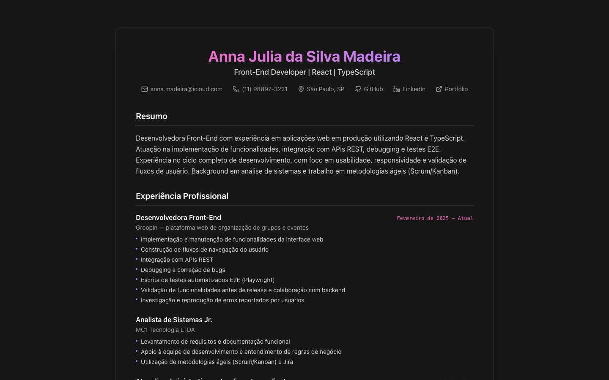
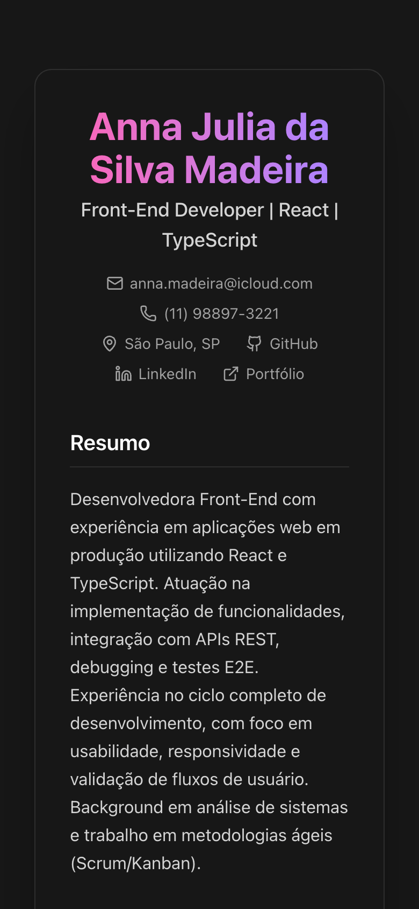

# Currículo Online

Meu currículo em formato de página web: resumo, experiência profissional, formação, certificações, idiomas e habilidades, com links diretos para contato, GitHub, LinkedIn e portfólio.

🔗 **[anna-madeira.github.io/curriculo](https://anna-madeira.github.io/curriculo/)**

## Telas

<p align="center">
  
  &nbsp;
  
</p>

## Tecnologias

- [Next.js 15](https://nextjs.org) (App Router, exportação estática)
- [React 19](https://react.dev)
- [TypeScript](https://www.typescriptlang.org)
- [Tailwind CSS 4](https://tailwindcss.com)
- [Lucide](https://lucide.dev) para os ícones

## Como funciona

Todo o conteúdo do currículo fica num único objeto (`resumeData`) no topo de `src/app/page.tsx`. Para atualizar uma experiência, habilidade ou certificação, basta editar esse objeto: a página é montada a partir dele.

O Next.js está configurado com `output: "export"`, então o build gera um site 100% estático na pasta `out/`, servido pelo GitHub Pages no caminho `/curriculo`.

## Rodando localmente

```bash
npm install
npm run dev
```

Acesse `http://localhost:3000/curriculo`.

## Deploy

Cada push na branch `main` dispara o workflow [`deploy.yml`](.github/workflows/deploy.yml), que roda o build e publica a pasta `out/` no GitHub Pages.
